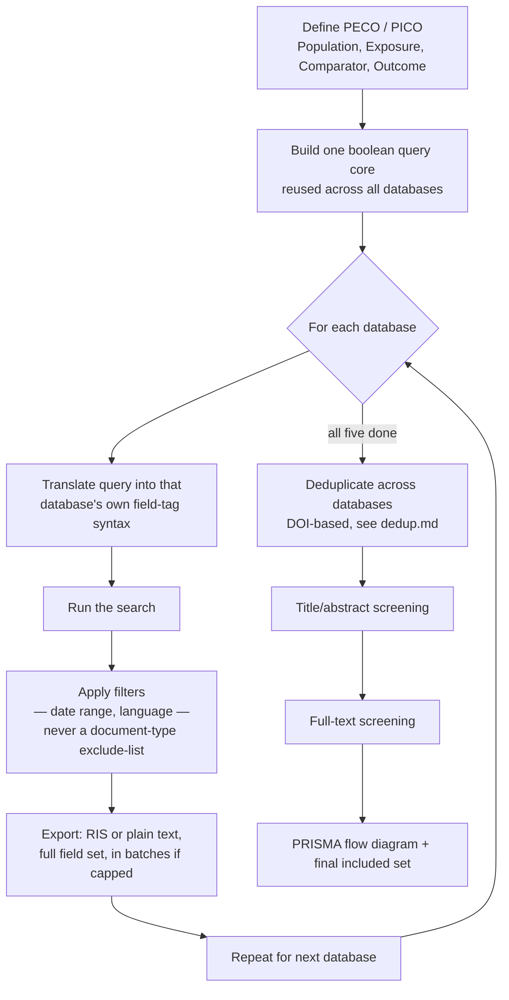

  

<h1 align="center">Systematic Review Search Strategy for Popular Databases</h1>

  A practical, step-by-step reference for running a reproducible, PRISMA-S-compliant literature search 
  across five major databases — PubMed, Scopus, Web of Science, CINAHL, and Cochrane CENTRAL.

---

## What this is

This repo is a reusable playbook, not a one-off project note. It was built while running the literature
search for a specific systematic review (breastfeeding vs. formula feeding and the infant gut
microbiome), but every guide here is written so the *process* — how to build the query, where the
UI traps are, how to export cleanly — carries over to any topic. Swap in your own search terms and the
steps, gotchas, and checklists still apply.

Each database guide includes:
- **Access path** — API vs. manual, and what institutional access looks like
- **Query syntax** — the field tags, boolean operators, wildcards, and proximity operators that database actually uses
- **Step-by-step navigation** — with a flowchart, because every one of these platforms buries the real search box somewhere non-obvious
- **Filters to apply, and filters to avoid** — some filters that look harmless silently drop eligible studies (documented with the specific incident that caught each one)
- **Export steps** — exact field selections, format choices, and batch-size limits
- **A worked example** — the actual query used for the source review, so you can see the pattern applied for real

## The five databases

| Database | Access | Platform | Scripted? |
|---|---|---|---|
| [PubMed](databases/pubmed.md) | Free, public | PubMed / E-utilities | ✅ Yes — API, no key required |
| [Scopus](databases/scopus.md) | Institutional subscription | Elsevier Scopus | ⚠️ Manual (unless you have API credentials) |
| [Web of Science](databases/web-of-science.md) | Institutional subscription | Clarivate WoS Core Collection | ⚠️ Manual (unless you have API credentials) |
| [CINAHL](databases/cinahl.md) | Institutional subscription | EBSCOhost | ❌ Manual only — no public API |
| [Cochrane CENTRAL](databases/cochrane-central.md) | Free, public | Cochrane Library | ❌ Manual only — no public API |

Embase is deliberately not covered here — it requires a license most institutions don't carry, and
nothing below assumes you have it. If you do, the same general approach (PECO → boolean query →
filters → export → dedupe) still applies; you'd just be adding a sixth column to the table above.

## The overall workflow

## Two deduplication strategies — pick one deliberately

There isn't one correct way to handle duplicates across five databases, and this repo's own search
history switched strategies partway through. Both are documented in [dedup-strategies.md](dedup-strategies.md):

1. **Pre-filter locally, then import only new records** — compute DOI-based overlap yourself before
   anything touches your screening tool, and only import records that aren't already decided.
   Faster to screen, but the dedup logic lives in your own script, not in an audited tool.
2. **Import everything raw, let your screening tool's own duplicate-detection handle it** — the
   standard practice most systematic review guidance assumes. Produces a cleaner audit trail (a human
   reviews and confirms every proposed merge) but means importing records your platform will show you
   again as "duplicate" prompts.

Neither is wrong. Decide which one your review team wants *before* the first database is imported into
your screening tool — switching mid-way (which is what happened on the source review) means retrofitting
already-imported data, which is exactly the kind of avoidable rework this repo exists to help you skip.

## Common pitfalls across all five databases

These showed up independently on at least two different databases during the source review, which is
why they're called out here instead of buried in one guide:

- **A field tag that looks like a DOI tag isn't always one.** Several databases (Scopus, Web of
  Science) reuse the `M3` RIS tag for a document-type label ("Article", "Book Chapter") rather than a
  DOI when no real DOI exists. Any DOI-extraction script needs to validate the value actually matches
  a DOI pattern before trusting it — otherwise every untagged record collapses onto the same fake key
  and gets silently dropped as a duplicate of every other untagged record. See each database's guide
  for the specific fix.
- **Document-type / publication-type exclude-filters are not safe defaults.** A filter like "exclude
  Reviews" or "Research Articles only" looks like free precision, but pooled-reanalysis and
  individual-participant-data studies are frequently misclassified by the vendor as "Review" or similar.
  Build exclusions into your boolean query's text instead (e.g. `NOT (review OR meta-analysis)`) so you
  control the logic, and use the platform's own type filter only as a narrow keep-list for the format
  you're certain you want (see the WoS and Scopus guides for the exact incident that caught this).
- **Row-based / line-based query builders can silently lose your parentheses.** CINAHL and similar
  EBSCO-family tools group each query *row* as an atomic clause before combining rows with a boolean
  operator — but the on-screen rendering of the combined query often displays it as one flattened,
  unparenthesized line. Paste each concept group into its own row rather than trying to type one long
  boolean string; see the CINAHL guide for what the (harmless-looking) flattened display actually means.
- **Export caps are real and silent.** Web of Science caps RIS export at 1,000 records per batch with
  no on-screen warning beyond the batch boundary you choose. Concatenating batches naively can leave a
  byte-order-mark (BOM) character stranded mid-file, which silently breaks record-counting regexes.
  Always verify your post-export record count against the platform's own reported hit count.

## License

Public domain / CC0 — reuse, adapt, and redistribute freely. No attribution required, though a link
back is always appreciated.
