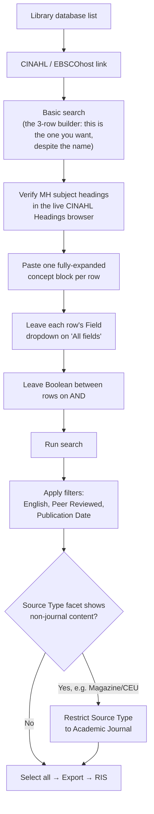

# CINAHL (via EBSCOhost)

**Access:** Institutional subscription, via your library's CINAHL/EBSCOhost link. **Scripted:** No.
EBSCO has no public search API for CINAHL, so this is fully manual.

## Navigation



## Query syntax

CINAHL subject headings resemble MeSH but diverge. **Verify every heading against the live CINAHL
Headings thesaurus** once you're logged in; don't assume a MeSH term name carries over exactly.

- `MH "Term+"`: CINAHL subject heading, `+` explodes to include narrower terms
- `TI (...)` / `AB (...)`: title / abstract free text
- Standard boolean `AND`/`OR`, wildcard `*`

### The 3-row builder, and the parentheses illusion

CINAHL's "Basic search" screen (confusingly named; it's actually the one with real power here) gives
you **3 rows joined by boolean dropdowns** (default `AND`). The critical thing to understand is that
**each row is grouped as one atomic clause internally**, even though the combined query's on-screen
display (in the search-history tab title, for instance) renders it as one long
unparenthesized-looking string. Don't panic when you see `(MH "X") OR (MH "Y") OR TI(...) AND (MH
"Z") OR TI(...)` displayed flat. If you built it by pasting one full concept group per row, the
actual logic is correctly grouped.

What you should **not** do is paste one giant flattened boolean string into a single row and expect
CINAHL to parse your own parentheses the way you intend. The row-based grouping is what's actually
authoritative, not your typed parens.

```
Row 1 (feeding concept: exposure and comparator):
(MH "Breast Feeding+") OR (MH "Milk, Human+") OR (MH "Lactation+") OR (MH "Infant Formula+")
OR (MH "Bottle Feeding+") OR TI ( breastfeed* OR breastfed OR "breast fed" OR "human milk"
OR "breast milk" OR "infant formula" OR "formula fed" OR "formula feeding" OR "bottle fed"
OR "artificial feeding" ) OR AB ( same free-text block as TI )

Row 2 (outcome concept: microbiome):
(MH "Microbiota+") OR (MH "Gastrointestinal Microbiome+") OR (MH "Metagenomics+")
OR TI ( microbiom* OR microbiot* OR microflora OR "gut flora" OR metagenom* OR "16S"
OR "intestinal bacteria" ) OR AB ( same free-text block as TI )

Row 3 (population concept: infant):
(MH "Infant+") OR (MH "Infant, Newborn+") OR TI ( infant* OR neonat* OR newborn* OR infancy
OR baby OR babies ) OR AB ( same free-text block as TI )

Boolean between rows: AND
```

## Filters

- **English Language.** Apply.
- **Peer Reviewed.** Apply. This is a *journal-level* classification (every article in a
  peer-reviewed journal gets this flag), not an article-type tag, so it's safe.
- **Publication Date.** Apply your review's date range.
- **Do NOT check "Research Article"** in the Publication Type facet. It looks like a harmless
  refinement, but it carries the same misclassification risk already documented for Scopus and WoS's
  document-type filters: a pooled-reanalysis study can be tagged under a different CINAHL publication
  type and get silently excluded.

## The Source Type facet: a filter worth adding that most guides don't mention

After running your search, check the **Source Type** facet breakdown. CINAHL indexes magazines and
Continuing Education Units (CEUs) alongside academic journal content, and some of this content can
slip past the "Peer Reviewed" filter (that flag is journal-level, and a nominally peer-reviewed
journal can occasionally carry non-article content like a CEU module). If you see non-trivial counts
under **Magazine** or **CEU**, restrict **Source Type to Academic Journal**. These content types
categorically cannot contain the kind of primary empirical research most systematic reviews need, so
this is a safe, precision-improving filter, unlike the Publication Type trap above.

## Export

Select all, then **Export**, then choose **RIS** format, specifically the **generic/plain RIS**
option rather than one tied to a specific reference manager like EndNote directly (the generic option
parses more predictably with most RIS-reading scripts). Increase "Results per page" to the maximum
first, and use the Share/Export menu's "export all results" option rather than selecting checkboxes
page by page.

## Worked example (from the source review)

- Raw query result: 852.
- After restricting Source Type to Academic Journal: **820**.
- Deduplicated against already-screened PubMed, Scopus, and WoS: 342 genuinely new records.
