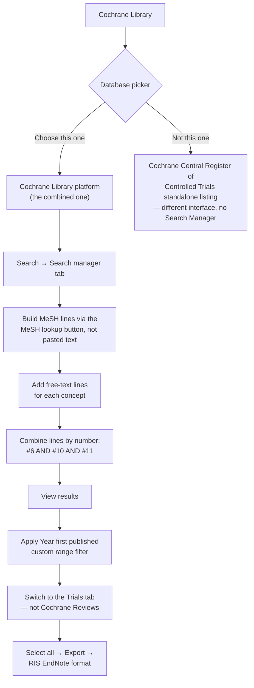

# Cochrane CENTRAL (via Cochrane Library)

**Access:** Free, public (institutional login may still apply for convenience, but CENTRAL itself
doesn't require a paid subscription). **Scripted:** No public API. Fully manual.

CENTRAL indexes **trial reports only**, so this search serves the interventional/RCT slice of your
eligibility criteria — expect a small, high-precision set relative to the other four databases.

## Navigation



**Critical first step:** at the database picker, select **"Cochrane Library"**, not the standalone
"Cochrane Central Register of Controlled Trials (CENTRAL)" listing. The standalone listing routes
through a different (EBSCO/Elsevier-contributed) interface that doesn't support the `#1, #2, ...`
Search Manager syntax below at all. The Cochrane Library platform is also what lets you see Cochrane
Reviews, CENTRAL/Trials, Editorials, and Clinical Answers as separate tabs from one search — only the
**Trials** tab is CENTRAL.

## Query syntax: numbered search lines, not one boolean string

Cochrane's Search Manager builds `#1`, `#2`, `#3`... as you run each line, then lets you combine them
by number (`#6 AND #10 AND #11`). This is actually the **safest** query-building approach of all five
databases — since each combine step references an already-computed result set rather than raw boolean
text, there's no operator-precedence risk (unlike CINAHL's row-grouping situation, or a hand-typed
boolean string with missing parentheses).

```
#1  MeSH descriptor: [Breast Feeding] explode all trees
#2  MeSH descriptor: [Milk, Human] explode all trees
#3  MeSH descriptor: [Infant Formula] explode all trees
#4  MeSH descriptor: [Bottle Feeding] explode all trees
#5  (breastfeed* OR breastfed OR "breast fed" OR "human milk" OR "breast milk"
     OR "infant formula" OR "formula fed" OR "formula feeding" OR "bottle fed"
     OR "artificial feeding"):ti,ab,kw
#6  #1 OR #2 OR #3 OR #4 OR #5

#7  MeSH descriptor: [Microbiota] explode all trees
#8  MeSH descriptor: [Metagenomics] explode all trees
#9  (microbiom* OR microbiot* OR microflora OR "gut flora" OR metagenom*
     OR "16S" OR "intestinal bacteria"):ti,ab,kw
#10 #7 OR #8 OR #9

#11 (infant* OR neonat* OR newborn* OR infancy OR baby OR babies):ti,ab,kw

#12 #6 AND #10 AND #11
```

### Don't paste `MeSH descriptor: [...]` lines directly

Pasting that exact text into the query box can trip a "special characters not supported" parse error —
this is a copy-paste artifact (invisible formatting carried over from a rendered code block), not an
actual syntax problem with the query. **Use the line's own MeSH lookup button instead**: search the
term, check "explode all trees," and add it to the search manager from there. If the thesaurus doesn't
have an exact-name match for a term (e.g. it might offer "Metagenome" instead of "Metagenomics"), that's
a low-stakes substitution as long as your free-text line already covers the same root term with a
wildcard (`metagenom*` catches both).

## Filters: date yes, language no

- **Publication Date** — apply your review's range, using the left filter panel's **"Year first
  published"** facet with a custom range (not the separate "Date added to CENTRAL trials database"
  facet, which tracks indexing recency, not publication year — easy to confuse, they sit right next to
  each other).
- **Do not apply a language filter.** CENTRAL's records are sparsely language-tagged, and the filter
  removes eligible English trials along with the non-English ones — a false-negative problem, not a
  precision gain. Apply the English-language criterion during title/abstract screening instead, where
  you can actually read the record to confirm.

## Export

Switch to the **Trials** tab (not Cochrane Reviews — that tab holds systematic reviews, a different
publication type entirely) before exporting. Select all → **Export selected citations** → **RIS
(EndNote)** format.

### Two export quirks

1. **Non-standard RIS header lines.** Cochrane's RIS export wraps every record in header lines like:
   ```
   Record #1 of 611
   Provider: John Wiley & Sons, Ltd.
   Content: text/plain; charset="UTF-8"

   TY  - JOUR
   ...
   ```
   Any RIS parser you write needs to skip lines starting with `Record #`, `Provider:`, or `Content:`
   before hitting the actual `TY` tag — they're not part of the RIS spec, but Cochrane includes them
   anyway.
2. **The save dialog may append a duplicate extension.** The downloaded file can end up named
   `central_search.ris .ris` (note the space before the second `.ris`). Check the actual saved filename
   and rename if needed before importing it anywhere that expects a clean `.ris` extension.

## Worked example (from the source review)

- Raw `#12` result: 693 (6 Cochrane Reviews + 687 Trials).
- After the Year 2010–2026 custom range filter, Trials tab: **611**.
- Deduplicated against already-screened PubMed + Scopus + WoS + CINAHL: 320 genuinely new records.
