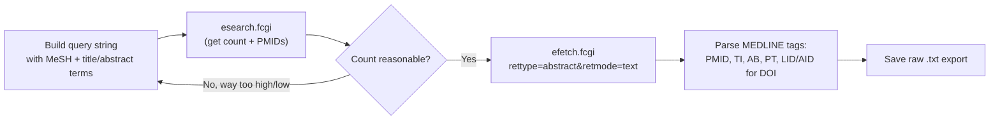

# PubMed / MEDLINE

**Access:** Free, public. **Scripted:** Yes, via NCBI's E-utilities — no API key required for
light use (stay under ~3 requests/second; register for a free API key if you need more).

## Why this one is different from the rest

PubMed is the only database in this set with a documented, stable, keyless public API. Every other
database here either requires paid institutional API credentials you probably don't have (Scopus, Web
of Science) or has no API at all (CINAHL, CENTRAL). That makes PubMed the one search you can fully
script and re-run identically forever — treat it as your baseline, and expect the other four to cost
real manual time per execution.

## The three E-utilities endpoints you need

| Endpoint | Purpose |
|---|---|
| `esearch.fcgi` | Run the query, get back a count and a list of PMIDs |
| `esummary.fcgi` | Get titles/metadata for a list of PMIDs |
| `efetch.fcgi` | Get full MEDLINE records (title, abstract, DOI, publication type) for a list of PMIDs |



## Query syntax

PubMed search fields, the ones you'll actually use:

- `[tiab]` — title or abstract
- `[mesh]` — Medical Subject Heading (use sparingly combined with free text; MeSH indexing lags
  publication by months, so a MeSH-only query misses recent papers)
- `[pt]` — publication type (e.g. `Review[pt]` to find, or `NOT Review[pt]` to exclude)
- `[dp]` — date of publication, as `"2010/01/01"[dp] : "2026/12/31"[dp]`

Boolean operators `AND`, `OR`, `NOT` — must be capitalized. Wrap each concept group in its own
parentheses, then combine:

```
(breastfeed*[tiab] OR "breast fed"[tiab] OR "human milk"[tiab] OR "breast milk"[tiab]
 OR "infant formula"[tiab] OR "formula fed"[tiab] OR "formula feeding"[tiab]
 OR "bottle fed"[tiab] OR "artificial feeding"[tiab])
AND
(microbiom*[tiab] OR microbiot*[tiab] OR microflora[tiab] OR "gut flora"[tiab]
 OR "16S"[tiab] OR metagenom*[tiab] OR "intestinal bacteria"[tiab])
AND
(infant*[tiab] OR infancy[tiab] OR neonat*[tiab] OR newborn*[tiab] OR baby[tiab] OR babies[tiab])
AND ("2010/01/01"[dp] : "2026/12/31"[dp])
AND English[la]
```

## Running it

```bash
# 1. Get the count and PMID list (URL-encode the query)
curl -G "https://eutils.ncbi.nlm.nih.gov/entrez/eutils/esearch.fcgi" \
  --data-urlencode "db=pubmed" \
  --data-urlencode "term=YOUR QUERY HERE" \
  --data-urlencode "retmax=10000" \
  --data-urlencode "retmode=json"

# 2. Fetch full records for those PMIDs (comma-separated, batch in groups of ~200)
curl -G "https://eutils.ncbi.nlm.nih.gov/entrez/eutils/efetch.fcgi" \
  --data-urlencode "db=pubmed" \
  --data-urlencode "id=PMID1,PMID2,PMID3" \
  --data-urlencode "rettype=abstract" \
  --data-urlencode "retmode=text" \
  > pubmed_export.txt
```

**Rate limit:** sleep ~0.35s between calls without an API key (3/sec limit); with a free registered
key, sleep ~0.1s (10/sec limit).

## Parsing the raw export

MEDLINE text format uses fixed tags, with a 6-space continuation indent for wrapped lines:

```
PMID- 12345678
TI  - Full title of the paper, possibly
      wrapped across multiple lines like this
AB  - Abstract text, same wrapping rule applies.
PT  - Journal Article
PT  - Randomized Controlled Trial
LID - 10.1234/example.doi [doi]
AID - 10.1234/example.doi [doi]
```

- `PMID-` starts each record — split the file on `\nPMID- ` to separate records.
- `TI`, `AB` — title, abstract. Normalize continuation-line wrapping with a regex like
  `re.sub(r'\n\s{6}', ' ', field_text)` before trusting the text as one string.
- `PT` — publication type, repeats once per tag (a paper can carry both `Journal Article` and
  `Randomized Controlled Trial`). Collect all occurrences, don't just take the first.
- `LID` / `AID` with a trailing `[doi]` marker — the DOI. Not every record has one.

## A known gotcha worth building in from day one: the pooled-reanalysis arm

If your review's eligibility criteria exclude pooled re-analyses of public sequencing data (studies
that reanalyze someone else's raw data rather than reporting a new cohort) but you still want to track
them as comparators, run a **second, parallel search** with the opposite reanalysis filter:

```
<same query as above, but replace the Boolean logic with:>
AND (reanalys* OR "re-analysis" OR "pooled analysis" OR "publicly available"
     OR "individual participant" OR "cross-cohort")
```

This catches integrative meta-analyses that reanalyze public sequence data — these get indexed as
original research, not as systematic reviews, so a standard `NOT Review[pt]` filter on your main search
won't exclude them, and they'll silently slip into your main corpus unless you deliberately search for
them and divert them to a separately-tracked set.

## Worked example (from the source review)

- **Primary corpus query:** executed 2026-10-01, **2,109 results**.
- **Pooled-reanalysis arm:** executed same day, **40 results**, of which 24 overlapped the primary
  corpus (same papers matched both searches) and 16 were genuinely separate.
