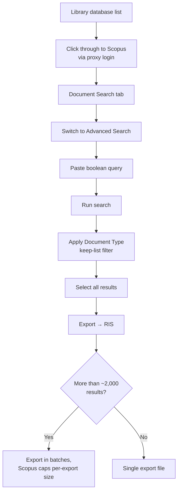

# Scopus (Elsevier)

**Access:** Institutional subscription, typically via your library's proxy login. **Scripted:**
Only with institutional API credentials (`pybliometrics`, Elsevier Developer Portal). Most
institutions provide library-mediated *browser* access without exposing API keys, in which case this
is a manual search with an RIS export.

## Navigation



## Query syntax

Scopus Advanced Search uses field codes with parentheses-heavy boolean logic:

- `TITLE-ABS-KEY(...)`: searches title, abstract, and author keywords in one go (the field you'll use most)
- `TITLE(...)`, `ABS(...)`, `KEY(...)`: individually, if you need to scope tighter
- `*`: wildcard (zero or more characters)
- `W/n`: proximity, within *n* words, order-independent
- `PRE/n`: proximity, within *n* words, in the order given
- `AND NOT`: Scopus's exclusion operator (not plain `NOT`)
- `PUBYEAR > 2009 AND PUBYEAR < 2027` or `PUBYEAR AFT 2009`: date filtering inside the query itself, as a supplement to the UI date filter or in place of it

```
TITLE-ABS-KEY(
  (breastfeed* OR "breast fed" OR "human milk" OR "breast milk" OR "infant formula"
   OR "formula fed" OR "formula feeding" OR "bottle fed" OR "artificial feeding")
  AND
  (microbiom* OR microbiot* OR microflora OR "gut flora" OR metagenom*
   OR "16S" OR "intestinal bacteria")
  AND
  (infant* OR infancy OR neonat* OR newborn* OR baby OR babies)
  AND NOT
  (reanalys* OR "pooled analysis" OR "individual participant" OR "publicly available")
)
AND PUBYEAR > 2009 AND PUBYEAR < 2027
```

## The export field checklist

When Scopus asks "what information do you want to export," check:
- **Citation information**: Author(s), Document title, Year, EID, Source title, Citation count,
  Source & document type, **DOI**
- **Bibliographical information**: Serial identifiers (ISSN), **PubMed ID**. Include this even
  though most RIS parsers don't read it; it's invaluable for manual cross-referencing against PubMed
  later.
- **Abstract & keywords**: Abstract, Author keywords, Indexed keywords

Export format: **RIS**.

## Gotcha #1: `M3` is a document-type label, not a DOI

This is the single most consequential bug encountered across all five databases, and it's worth
building a defense against from the start. Scopus RIS exports put the real DOI in the `DO` tag. When
a record has **no** `DO` tag, though, a naive DOI-extraction script might fall back to the `M3` tag
expecting a DOI there too. `M3` actually holds a document-type label: `Article`, `Book Chapter`,
`Conference Paper`, `Review`, and so on.

If your extraction code does something like:

```python
# WRONG: trusts M3 blindly as a fallback DOI source
direct = first(record, ("DO", "M3"))
if direct:
    m = DOI_PATTERN.search(direct)
    return m.group(0) if m else direct   # <-- falls through to the raw text!
```

...then every record tagged `M3 - Article` with no real DOI gets the literal string `"article"` as its
"DOI." Since you're almost certainly deduplicating by DOI, **every such record collapses onto the same
fake key**, and your dedup logic discards all but one of them as duplicates of each other. You can
silently lose potentially dozens of genuinely distinct papers this way. The fix: only accept a
`DO`/`M3` value as a DOI if it actually matches a DOI regex (`10\.\d{4,9}/\S+`). Otherwise treat the
record as having no DOI at all and fall back to a title-based key.

```python
# CORRECT: validates before trusting
def extract_doi(record):
    for tag in ("DO", "M3"):
        values = record.get(tag)
        if values and values[0].strip():
            m = DOI_PATTERN.search(values[0])
            if m:
                return norm_doi(m.group(0))
    return ""  # genuinely no DOI -- use a title-based fallback key instead
```

## Gotcha #2: Document Type filters can exclude the studies you most want

A pooled-reanalysis or individual-participant-data study is frequently tagged by Scopus as `Review`
even when it reports new comparative analysis, because Scopus's document-type classification looks at
structure, not content. If your search needs to capture this kind of study (common for systematic
reviews that treat reanalyses as comparators), **do not** apply a Document Type filter that excludes
"Review." Build your review/reanalysis exclusion into the query's text instead (`AND NOT (...)`),
where you control the logic precisely.

## Worked example (from the source review)

- **Primary corpus:** 3,461 raw results.
- **Pooled-reanalysis arm** (same query core, swap `AND NOT` for `AND`, drop the document-type filter
  entirely): 49 raw results.
- Combined and deduplicated against an already-screened PubMed set: 1,618 genuinely new records.
