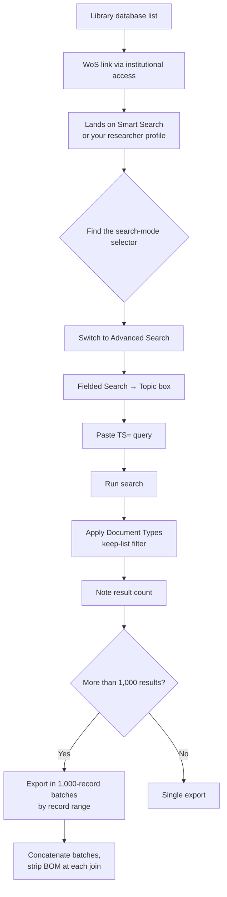

# Web of Science (Clarivate)

**Access:** Institutional subscription, via your library's WoS link (not a direct Clarivate login;
going direct won't carry your institutional entitlement). **Scripted:** Only with institutional API
credentials (`WOS_API_KEY_EXTENDED`). Otherwise it's manual, with RIS export.

## Navigation

The interface has several search *modes* hiding behind a dropdown/tab selector near the top. Don't
assume the first thing you land on (often **Author Search**) is where you want to be.



## Query syntax

- `TS=(...)`: Topic search, combining title, abstract, author keywords, and Keywords Plus (the
  broadest field, use this for your main query)
- `TI=(...)`: title only
- `*`: wildcard, zero or more characters
- `$`: wildcard, exactly zero or one character (useful for British/American spelling: `coloni$ation`)
- `NEAR/n`: proximity, within *n* words, either order
- `NOT (...)`: exclusion, standard
- `AND LA=English`: language filter
- `AND PY=2010-2026`: publication year range

```
TS=(
  (breastfeed* OR "breast fed" OR "human milk" OR "breast milk" OR "infant formula"
   OR "formula fed" OR "formula feeding" OR "bottle fed" OR "artificial feeding")
  AND
  (microbiom* OR microbiot* OR microflora OR "gut flora" OR metagenom* OR "16S"
   OR ( gut NEAR/2 coloni$ation ))
  AND
  (infant* OR infancy OR neonat* OR newborn* OR baby OR babies)
  NOT
  (reanalys* OR "pooled analysis" OR "individual participant" OR "publicly available")
)
AND LA=English AND PY=2010-2026
```

## The Document Types filter: keep-list, not exclude-list

Apply this filter **as a keep-list**: check only the specific document types you want (**Article**,
**Early Access**, **Retracted Publication**), rather than unchecking the ones you don't want. Two
notes on exactly those three:

- **"Early Access"** is WoS's tag for online-ahead-of-print. It's not a separate content category;
  it's the same article not yet assigned to an issue. Leave it checked, or you'll silently drop
  recently published papers.
- **"Retracted Publication"** should also stay checked if your protocol runs a retraction check at the
  *end* of screening, as most PRISMA-compliant protocols do. Excluding retracted papers at the search
  stage pre-empts that check instead of feeding it.

Leave everything else (Review Article, Book Chapters, Proceeding Paper, Editorial Material, Meeting
Abstract, Correction, Letter, Book, News Item) unchecked.

**Do not apply this filter at all to a pooled-reanalysis arm search.** See the Scopus guide for why:
the same underlying risk applies, since a reanalysis study genuinely useful to your review can be
tagged `Review`, and a keep-list that excludes Review would silently drop it.

## Export workflow and the 1,000-record cap

WoS caps RIS export at 1,000 records per pass, with no on-screen warning beyond the point where you
have to choose a record range. For anything over 1,000 results:

1. Export records 1 through 1000.
2. Export 1001 through 2000.
3. Continue in 1,000-record chunks until you reach the total.
4. Concatenate all batch files into one.

**Export field selection:** Author(s), Title, Source, ISSN, PubMed ID, Abstract, Document Type,
Keywords, Language. (DOI comes through automatically embedded under "Source" information, not as its
own checkbox.)

### The BOM-stranding bug

Each separately-downloaded batch file carries its own UTF-8 byte-order-mark (BOM) character at the
very start of the file. If you concatenate batches naively with `cat batch1.ris batch2.ris batch3.ris
> combined.ris`, you get **three BOMs**: one at the true start of the file (harmless) and two more
stranded in the *middle* of the combined file, right at each join point. A BOM mid-file silently
breaks any record-counting regex anchored on line-start (`^TY  -`), undercounting by exactly one
record per internal join.

**Fix:** read and decode each batch file separately (`encoding="utf-8-sig"` in Python strips a
leading BOM automatically) before joining the *decoded text*, rather than concatenating raw bytes.
This structurally avoids the problem instead of requiring a cleanup pass afterward.

```python
texts = [open(f, encoding="utf-8-sig").read().rstrip() for f in batch_files]
combined = "\n\n".join(texts) + "\n"
```

Always verify your final concatenated record count against WoS's own reported hit count before
trusting the file.

## Gotcha: `DI` vs `DO`, check empirically and don't assume

Different RIS exporters use different DOI tags. WoS uses `DO`. (Scopus also uses `DO`. Cochrane
CENTRAL also uses `DO`. None of them use `DI`, despite that being a plausible guess; "DI" is more
associated with some EndNote-style exports from other platforms.) **Open a raw export and look at an
actual record before writing an extraction script.** This exact wrong-tag assumption cost a full
re-check of an overlap analysis during the source review, when a script assumed `DI` and silently
found 0% DOI coverage instead of the ~99% that was actually there.

## Worked example (from the source review)

- **Primary corpus:** 4,841 raw results, 3,423 after the Document Types keep-list.
- **Pooled-reanalysis arm:** 54 results, no document-type filter applied.
- Combined and deduplicated against already-screened PubMed and Scopus: 927 genuinely new records.
