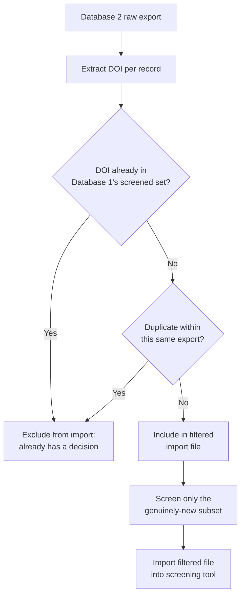
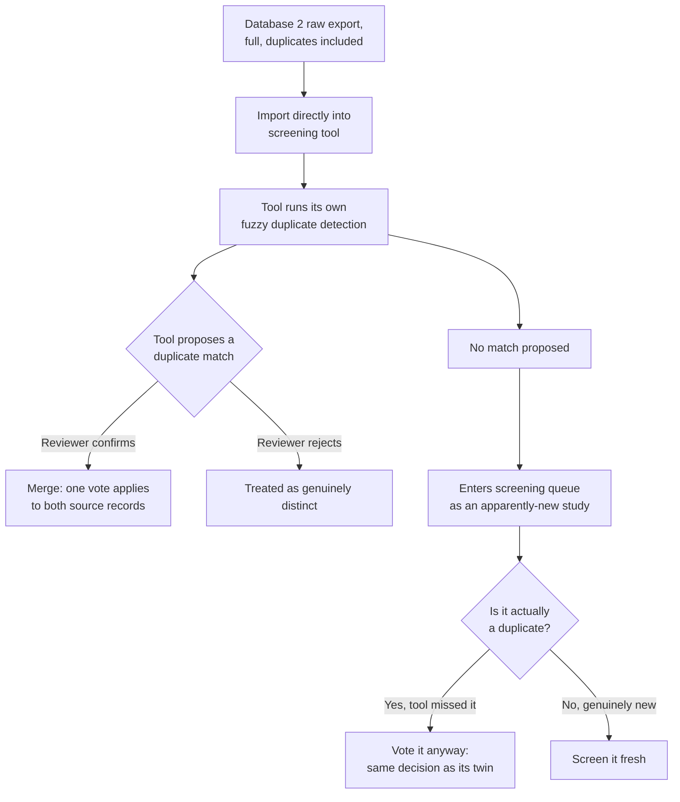
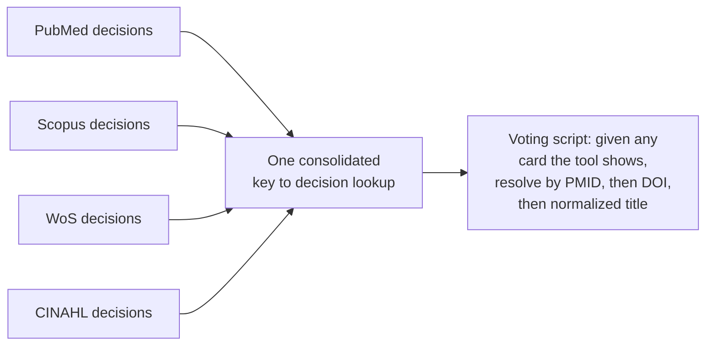

# Deduplication Strategies Across Databases

Once you've searched more than one database, the same paper will show up multiple times. Often it's
under a different document format, with different metadata completeness, and sometimes with a
different DOI rendering (case, trailing period, embedded vs. missing). You need a deliberate strategy
for handling this *before* you start importing into a screening tool (Covidence, Rayyan,
EPPI-Reviewer, etc.), not after.

There are two defensible approaches. Pick one and commit. Switching mid-review means retrofitting
already-imported data, which costs more time than either approach costs on its own.

## Strategy 1: pre-filter locally, import only new records

**How it works:** before touching your screening tool, build a local DOI-indexed map of every record
already decided (from Database 1, then Database 1+2, and so on). For each new database's raw export,
normalize and extract each record's DOI, check it against the running map, and only pass through
records that are genuinely new. Screen *only* those. Import *only* those.

**Pros:**
- Much less screening volume. You never re-read a paper you've already judged.
- The screening tool's queue stays clean, with no "is this a duplicate?" prompts to resolve.

**Cons:**
- The dedup logic lives entirely in your own script. If it has a bug (see the Scopus guide's `M3`-tag
  incident), records can be silently and incorrectly dropped with no visible trace in your screening
  tool. You won't get a "here's what I merged" audit trail the way a platform's built-in dedup gives
  you.
- It's less conventional. Most systematic review methodology sections describe deduplication as
  happening *in* the reference manager or screening tool, so this approach needs its own explicit
  methods paragraph to stay transparent.

## Strategy 2: import everything raw, let your screening tool deduplicate

**How it works:** import each database's complete raw export, duplicates and all. Your screening tool
runs its own matching (usually title/author fuzzy-matching, sometimes DOI-aware) and proposes merges
for a human to confirm. Anything the tool doesn't catch as a duplicate just enters the screening queue
as an apparently-new study.

**Pros:**
- It matches how most published systematic reviews describe their deduplication methodology: a human
  reviewer confirms every merge, which is a cleaner audit trail for a methods section.
- There's no custom dedup script to get wrong.

**Cons:**
- Fuzzy title/author matching is not as precise as DOI matching. Expect some genuine duplicates to
  slip through as "new" (in practice, roughly 5% on a well-populated review, though this varies by
  platform and by how differently each database formats the same paper's metadata).
- If a record *does* slip through unmatched, **you still need a correct decision ready for it**. That
  means you need the DOI-based cross-referencing logic from Strategy 1 available as a safety net
  anyway, just not used to gate the import step.

## A practical hybrid, if you're voting via automation

If you're scripting the actual screening-tool votes rather than clicking through manually, Strategy
2's weakness (the tool might not catch every duplicate) has a clean fix: build **one consolidated
decisions lookup** covering every record from every raw export, not just the genuinely-new ones, where
each record's decision is simply whatever its first-screened duplicate was already decided as. Then
your voting script can resolve *any* card the screening tool shows you, whether the tool successfully
merged it or let it through as apparently-new, without needing to know in advance which outcome
occurred.

In short: screen each database's genuinely-new records once, as in Strategy 1, but import the full raw
export, as in Strategy 2, and let the tool's own dedup UI run. That gets you the audit-trail benefit of
Strategy 2 without re-screening anything, since every possible card the tool could show you already
has a resolved decision waiting.

## A note on multi-database voting scripts and shared queues

If more than one database's records land in the *same* screening-tool queue, which they will if you're
using Strategy 2 or the hybrid, a voting script that only knows about one database's decisions will
stop every time it encounters a card from a different database. It has no way to tell "this card has
no decision because it's genuinely unresolved" apart from "this card has no decision because I'm the
wrong script for it." Build one script that checks *every* database's decision source, by whichever
identifier is available (PMID, DOI, or title), rather than maintaining a separate script per database
once more than one database shares a queue.
